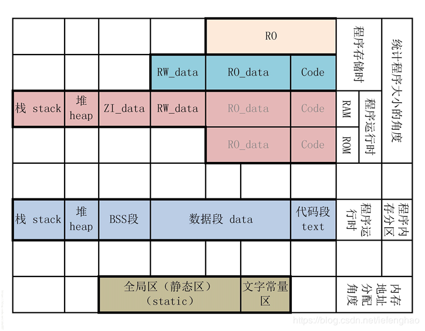
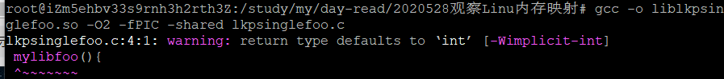
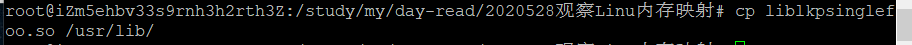
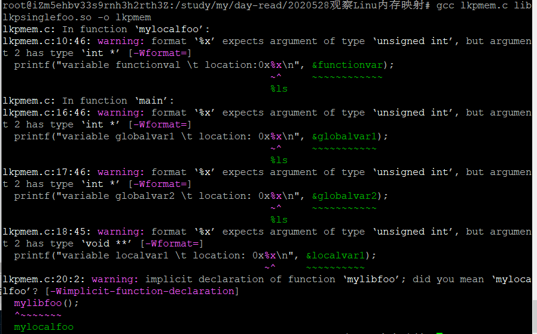
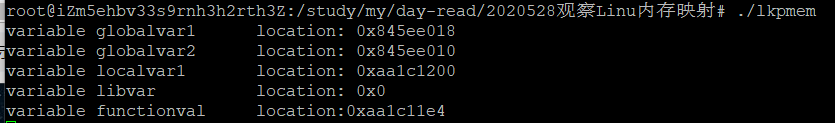
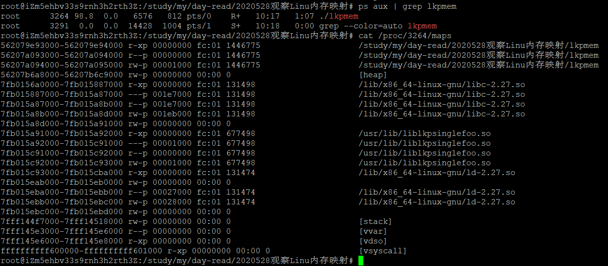

# 一、实验原理

**程序进程中的分区**

* **BSS段**：BSS segment，通常是指用来存放程序中未初始化全局变量的一块内存区域。

* **数据段**：data segment，通常是指用来存放程序中已初始化的全局变量的一块内存区域。

* **代码段**：code/text segment，通常是指用来存放程序执行代码的一块内存区域。
> 代码段的大小在程序运行前就已经确定，并且内存区域通常属于只读, 某些架构也允许代码段为可写，即允许修改程序。在代码段中，也有可能包含一些只读的常数变量，例如字符串常量等。

* **堆(heap)**：存放进程运行中被动态分配的内存段，它的大小并不固定，可动态扩张或缩减。
> 当进程调用malloc等函数分配内存时，新分配的内存就被动态添加到堆上（堆被扩张）；当利用free等函数释放内存时，被释放的内存从堆中被剔除（堆被缩减）。

* **栈(stack)**：又称堆栈，存放程序临时创建的局部变量。
> 在函数被调用时，其参数也会被压入发起调用的进程栈中，并且待到调用结束后，函数的返回值也会被存放回栈中。由于栈的后进先出特点，所以栈特别方便用来保存/恢复调用现场。


**程序文件中的分区**

* **Code**：代码域，它指的是编译器生成的机器指令。

* **RO_data**：ReadOnly data，即**只读数据域**，它指程序中用到的只读数据，全局变量。
> 例如C语言中const关键字定义的全局变量。

* **RW_data**：ReadWrite data，即**可读写数据域**，它指初始化为**非0值**的可读写数据。程序刚运行时，这些数据具有非0的初始值，且运行的时候它们会常驻在RAM区，因而应用程序可以修改其内容。
> 例如全局变量或者静态变量，且定义时赋予“非0值”给该变量进行初始化。

* **ZI_data**：ZeroInitialied data，即0初始化数据，它指初始化为“0值”的可读写数据域，它与RW_data的区别是程序刚运行时这些数据初始值全都为0，而后续运行过程与RW_data的性质一样，它们也常驻在RAM区，因而应用程序可以更改其内容。
> 包括未初始化的全局变量，和初始化为0的全局变量。

* **RO**：只读区域。
> 包括RO_data和code

当程序存储在ROM中，所占用的大小为**Code+RO_data+RW_data**

当程序执行时，RW_data和ZI_data在RAM中，RO_data和code视cpu架构（51、arm、x86）不同处于ROM或者RAM中。其中ZI_data对应BSS段，RW_data对应数据段，code对应代码段，RO_data对应数据段。



# 二、实验流程

## 1. 编译连接singlefoo.c为shared library


## 2. 拷贝动态库到默认动态库路径


## 3. 编译lkpmem.c


## 4. 运行测试程序


## 5.查看该测试程序的内存映射


# 三、二外命令
**ps command**
```shell
要对进程进行监测和控制，首先必须要了解当前进程的情况，也就是需要查看当前进程，ps命令就是最基本进程查看命令。

使用该命令可以确定有哪些进程正在运行和运行的状态、进程是否结束、进程有没有僵尸、哪些进程占用了过多的资源等等。

总之大部分信息都是可以通过执行该命令得到。

ps显示进程的瞬间状态，并不动态连续；如果想对进程进行实时监控应该用top命令。

参数：
-A：所有的进程均显示出来，与-e具有同样的效用；
-a：显示现行终端机下的所有进程，包括其他用户的进程；
-u：以用户为主的进程状态；
-x：通常与a这个参数一起使用，可列出较完整信息。
```

**grep command**
```shell
grep是Global Regular Expression Print的缩写，它搜索指定文件内容，匹配指定模式，默认情况下输出匹配内容所在行。

key point：grep只支持匹配而不能替换匹配到的内容。

语法格式：
grep [options] pattern [file...]

grep支持不同的匹配模式

默认BRE（basic regular expression）：支持的正则表达式语法有限

增强型ERE（extend regular expression）：支持更多的正则表达式

强悍型PRE：支持Perl语言的正则表达式

默认grep匹配指定文件中的内容，如果指定目录，需要加 -r 选项

例子：递归指定目录下所有文件

grep -r 'world' ~/project/
```

程序源码

lkpmem.c
```c
  1 #include<fcntl.h>
  2 #include<stdio.h>
  3 #include<stdlib.h>
  4
  5 int globalvar1;
  6 int globalvar2=3;
  7
  8 void mylocalfoo(){
  9         int functionvar;
 10         printf("variable functionval \t location:0x%lx\n", &functionvar);
 11 }
 12
 13 int main(){
 14         void *localvar1=(void *)malloc(2048);
 15
 16         printf("variable globalvar1 \t location: 0x%lx\n", &globalvar1);
 17         printf("variable globalvar2 \t location: 0x%lx\n", &globalvar2);
 18         printf("variable localvar1 \t location: 0x%lx\n", &localvar1);
 19
 20         mylocalfoo();
 21         mylibfoo();
 22
 23         while(1);
 24
 25         return(0);
 26 }
```

lkpsinglefoo.c
```c
  1 #include<stdio.h>
  2 #include<stdlib.h>
  3
  4 void mylibfoo(){
  5         int libvar;
  6         printf("variable libvar \t location: 0x%x\n", libvar);
  7 }
```

# 四、maps说明
```
内核每程的vm_area_struct项			/proc/pid/maps中的项		含义
vm_start 					“-”前一列，如562079e93000     虚拟地址空间起始地址

vm_end 						“-”后一列，如562079e94000     此段虚拟地址空间结束地址

vm_flags 					第三列，如r-xp 		此段虚拟地址空间的属性。每种属性用一个字段表示，r表示可读，w表示可写，x表示可执行，p和s共用一个字段，互斥关系，p表示私有段，s表示共享段，如果没有相应权限，则用’-’代替

vm_pgoff 					第四列，如000000000	对有名映射，表示此段虚拟内存起始地址在文件中以页为单位的偏移。对匿名映射，它等于0或者vm_start/PAGE_SIZE

vm_file->f_dentry->d_inode->i_sb->s_dev 	第五列，如fd:00 	映射文件所属设备号。对匿名映射来说，因为没有文件在磁盘上，所以没有设备号，始终为00:00。对有名映射来说，是映射的文件所在设备的设备号

vm_file->f_dentry->d_inode->i_ino 		第六列，如9176473 	映射文件所属节点号。对匿名映射来说，因为没有文件在磁盘上，所以没有节点号，始终为0。对有名映射来说，是映射的文件的节点号

						第七列，如/lib/ld-2.5.so 对有名来说，是映射的文件名。对匿名映射来说，是此段虚拟内存在进程中的角色。[stack]表示在进程中作为栈使用，[heap]表示堆。其余情况则无显示
```

