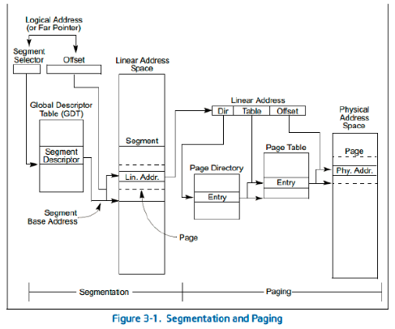
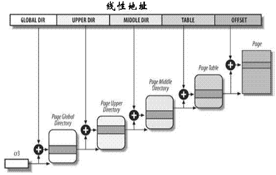
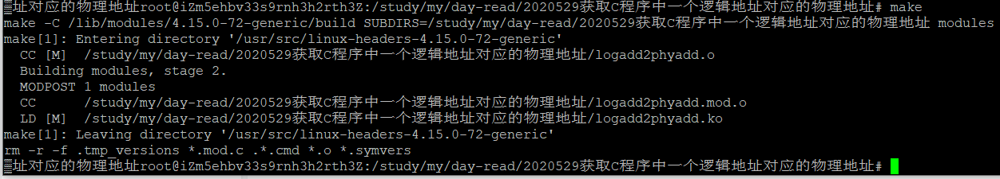
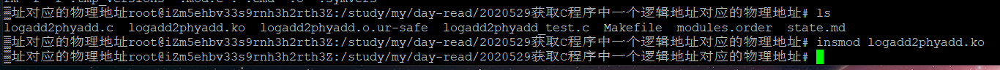
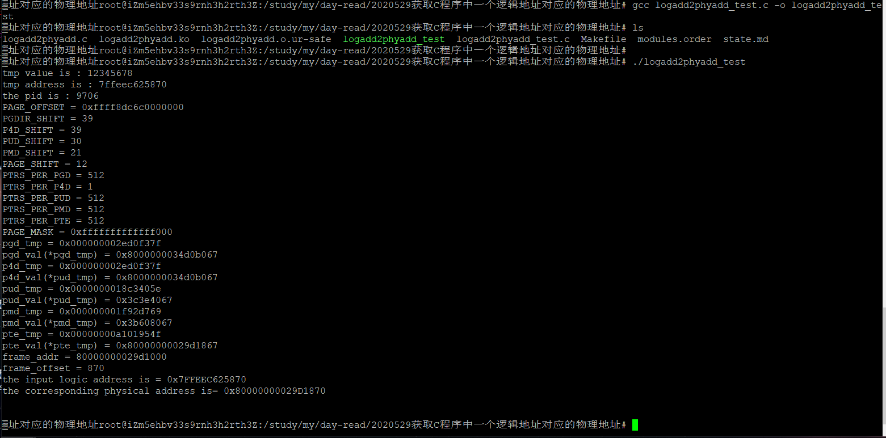

# 一、实验背景
目前Linux已经广泛应用在手机、PC、服务器、巨型机各类计算设备上。考虑到在各种体系结构上的适用性，Linux需要一种与具体的体系架构相对独立的内存管理方法。

目前越来越多的计算机设备采用的都是多处理机架构。多处理机架构适用的最为普遍的模型是共享存储多处理机SMP（Shared Memory multi-Processors）模型。

SMP又可以细分为一致存储结构UMA（Uniform Memory Access）模型和非一致存储结构NUMA（NonUniform Memory）模型。

Intel典型的IA32架构就属于UMA模型，而ARM通常采用NUMA模型。

Linux的物理内存管理主要由**内存节点node、内存区域zone和物理页框page**三级架构组成。

分页机制通过把线性地址空间中的页重新定位到物理地址空间来进行管理。为了应对32位和64位系统的不同需求，从2.6.11内核开始Linux采用了一种同时使用于32位和64位系统的四级分页模型，分为**页全局目录、页上级目录、页中间目录、页表**。

本实验通过获得不同的项来最终获得线性地址的物理地址。

# 二、实验原理
**内存节点node**：内存节点node是Linux对计算机系统物理内存的一种描述方法，一个总线主设备访问位于同一个结点node中的任意内存单元所花的代价相同，而访问任意两个不同结点中的内存单元所花的代价不同。
> Linux内核中使用数据结构pg_data_t来表示内存结点node，该结构定义在头文件<linux/mmzone.h>中。

**内存节点zone**：每个node结点又被划分为多个内存区zone。
> Linux使用结构体struct zone描述内存区域zone，在头文件<linux/mmzone.h>中给出了zone的具体定义。

**页面page**：在使用分页机制的情况下，物理内存一般是由固定尺寸的物理页框来表示，而从逻辑视角上内存使用固定尺寸的页面来表示。

下图是IA32的分段、分页及其地址映射机制：



> IA-32为Intel Architecture 32的简称。

1. 与IA32的结构相适应，Linux的内存地址映射机制也采用了段页式方法。但是与IA32不同的是，Linux内存寻址淡化了段的作用，而强调了页的作用。
2. Linux分页机制是在段机制之后进行的，它进一步将线性地址转换为物理地址。该过
程通常涉及两个重要问题，第一个是如何找到页表，第二个则是如何实现页表映射。

**从CR寄存器提取页表地址**
1. **每一个进程都有自己的页全局目录和自己的页表**。当发生进程切换时，Linux把CR3控制寄存器的内容保存在前一个执行进程的task_struct结构体中，然后把下一个要执行进程的task_struct结构体的值装入CR3寄存器中。因此，当新进程重新开始在CPU上执行时，分页单元就指向一组正确的页表。
2. 所以**内核可以直接从CR3寄存器获取当前进程的最高级页目录地址**。此时从段地址映射获得的线性地址提取相应的页目录表项，就可以获得该页目录的描述符了。

**页表映射机制** 
分页机制通过把线性地址空间中的页重新定位到物理地址空间来进行管理。之所以要进行多级页表映射，主要是考虑到内存管理的方便。


> 在C语言中输出的变量地址其实是一个虚拟地址，更准确地说是一个经过段机制变换后的线性地址。

# 三、实验目的
在IA32架构的Linux中，从一个变量出发到其对应的物理地址需要经过两次变换，一次是段映射，一次是页映射。通常情况下程序执行时，都是由操作系统完成页映射，程序员并不知道进程在执行期间所发生的地址转换。为此设计了一个内核模块将根据输入的进程pid以及线性地址去查找该线性对应的物理地址。该内核模块仍然以proc伪文件作为用户和内核之间交换数据的接口。

整个实验分为两个部分，一部分是完成分页地址映射的内核代码，一部分是用户测试程序。

在5.x中，使用了5级目录页结构，分别是pgd，p4d，pud，pmd，pte。

# 四、实验流程
## 1.运行make进行编译
```shell
make
```

## 2.内核模块加载
```shell
insmod logadd2phyadd.ko
```



## 3.编译logadd2phyadd_test.c并运行
```shell
gcc logadd2phyadd_test.c -o logadd2phyadd_test

./logadd2phyadd_test
```


