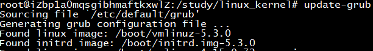
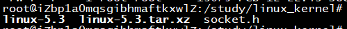
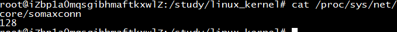
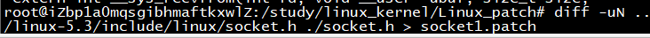
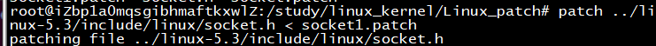
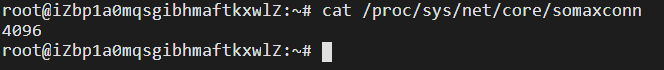

# 一、内核安装

> OS：Ubuntu18.04<br>
> 服务器：阿里云ECS

```c
a)	sudo apt-get install -y pkg-config
b)	sudo apt-get install -y build-essential 
c)	sudo apt-get install -y ncurses-dev
d)	sudo apt-get install -y libc6-dev
e)	sudo apt-get install -y bison
f)	sudo apt-get install -y flex
g)	sudo apt-get install -y libelf-dev
h)	sudo apt-get install -y libssl-dev
i)	ECS使用root权限不需要用sudo，除非提示权限不足
```

1. 下载镜像文件。

2. 传入云服务器。

3. 解压。

4. 把/boot/config-*下的config文件复制过来。
> cp /boot/config-* .config

5. 使用 **make menuconfig** 命令配置内核，直接跳至Exit退出即可。

6. make：内核编译，生成vmlinux内核文件**这个过程可能需要1h-3h**。
> make zlmage编译产生压缩形式的内核文件。<br>
> make bzlmage需要内核支持较多的外设和功能时，内核可能变得很大，此时可以用此命令编译本内核产生压缩率更高的内核文件。

7. make modules -> make modules_install -> make install

8. 配置GRUB文件
> 命令：update-grub<br>
> 升级grub文件（万物皆文件），第一行的内核是reboot后应用的内核。<br>
> > <br>
> <br>
> **可选**：vim /etc/default/grub 修改GRUB_TIMEOUT参数，设置GRUB界面显示时长，然后用update-grub命令更新grub。<br>
> <br>
> reboot重启服务器。

# 二、打补丁

**打补丁的本质就是用new feile替换old file**。

1. 用WinSCP将socket.h文件传入服务器；socket.h修改somaxconn参数，而somaxconn参数是用来定义系统每一个端口最大监听队列的长度，默认128。<br>


2. /proc目录：通过/proc文件系统可以在内核运行时访问其内部数据结构、改变内核设置。

> 查看somaxconn中的参数<br>
> <br>
> 如果 **vim** 中不显示行号，**vim ~/.vimrc** 文件中输入set number使得vim文件中显示行号<br>

3. 制作补丁 **diff -uN from-file to-file > x.patch** 
> from-file是old文件<br>
> to-file是new文件<br>
> 该命令就是比较两文件之间的差别进行补丁的制作<br>



4. 打补丁



5. 验证补丁

重新编译安装内核，然后重启查看确定是否生效。

可以使用内核提供的printk打印日志的方式验证更改的代码已经执行。但是由于内核进行大量的打印日志可能会造成日志存储区溢出，如果要对打印速度进行限制可以选择printk_ratelimit函数。

> cat /proc/sys/net/core/somaxconn

 
