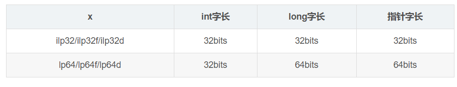
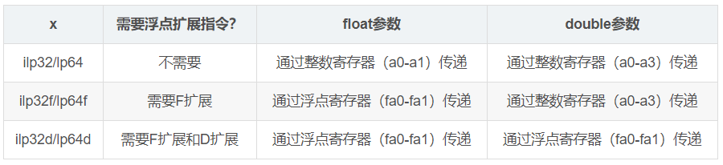

riscv64-unknown-linux-gnu-gcc该工具针对于riscv64架构的编译器，使用的C运行库为linux中的**标准glibc**。

# 本部分讨论RISC-V ISA中最基本的3个参数：-march、-mabi、-mtune
更详细的内容请参考：https://genekong.com/2018/09/20/part-1-risc-v-%E7%BC%96%E8%AF%91%E5%99%A8%E7%9A%84%E4%B8%89%E9%A9%BE%E9%A9%AC%E8%BD%A6%EF%BC%88-march%E3%80%81-mabi%E3%80%81-%E5%92%8C-mtune%EF%BC%89/

## 1. 参数简介
· -march=ISA 用于选择目标的架构，这个参数告诉编译器可以使用哪些指令或者哪种寄存器；
· -mabi =AIB 选择目标应用程序接口(ABI)，这个可以控制程序调用约定规则（例如使用哪种寄存器传递哪种参数，使用哪种寄存器返回数据）和数据在内存中的布局；
· -mtune=CODENAME 用于选择目标微架构，此参数可以告知GCC每条指令的性能，可以让工具进行一些针对目标的代码优化。

RISC-V数据模型，-mabi=ilp32, ilp32f, ilp32d, lp64, lp64f, lp64d

**选项：-mabi**

RISC-V GCC通过-mabi选项指定数据模型和浮点参数传递规则。

有效的选项值包括ilp32、ilp32f、ilp32d、lp64、lp64f 和 lp64d。前半部分指定数据模型，后半部分指定浮点参数传递规则。
> i指int，l指long，p指pointer即指针，32/64指前面给出的类型是32/64位的；f指float，指float型浮点数参数通过浮点数寄存器传递；d指double，指float型和double型浮点数参数通过浮点数寄存器传递。

数据模型：



浮点参数传递规则：




RISC_V GCC 使用手册对-mabi的说明：
```
地址：https://gcc.gnu.org/onlinedocs/gcc/RISC-V-Options.html

-mabi=ABI-string
    指定整数和浮点调用约定。ABI字符串包含两部分：整数类型的大小和用于浮点类型的寄存器。
    例如'-march = rv64ifd -mabi = lp64d'意思是'long'，并且指针是64位的（隐式定义了'整型'为32位），并且最大64位宽的浮点值在F寄存器中传递。
```
## 2. 浮点扩展指令
浮点参数传递规则只跟-mabi选项有关，和-march选项没有直接关系，但是部分-mabi选项需要浮点寄存器，浮点寄存器是通过浮点扩展指令引入的，这就需要在-march选项中指定浮点扩展。

-march = cpu-type

    优化选项。指定目标架构的名字，以及（可选的）一个或多个功能修饰符。 此选项的格式为: -march = arch {+ [no] feature} *
    gcc/g++在编译时，会生成针对目标架构优化的目标代码。
    注意： -march=native navite表示允许编译器自动探测目标架构（即：编译主机）并生成针对目标架构优化的目标代码。
