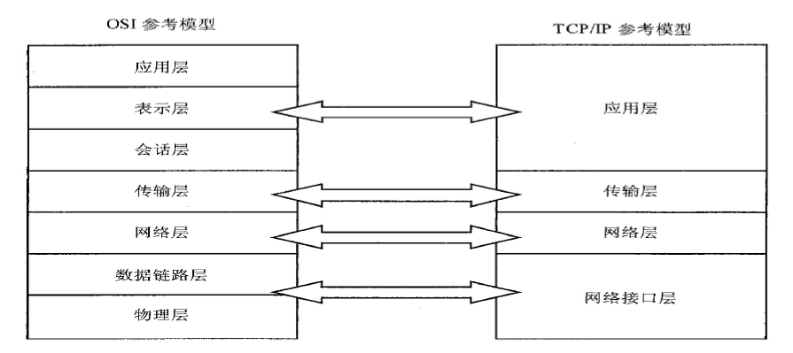

嵌入式网络编程主要使用Sockets技术。

## 1.Sockets通信
**Sockets主要用于不同机器上的进程之间的通信，也可以用于同一台机器上进程之间的通信！**，它不仅在Unix和Linux中广泛使用，其他OS报错嵌入式OS也支持Socket通信。

Socket常见的应用是：多客户端连接到一个服务器，即C/S服务架构。

Socket通信依赖于TCP/IP协议。

程序员可以通过Socket的接口函数在TCP/IP网络上开发应用程序。通常是针对C/S框架下的应用开发。

Socket在Unix OS中得到普遍应用。在Linux中，网络编程也是通过Socket来完成的。两个网络程序（**进程**）之间的网络连接包括五种信息：
> 1. 通信协议。
> 2. 本地地址。
> 3. 本地主机端口。
> 4. 远端主机端口。
> 5. 远端协议端口。

但是，每一端的socket只需要一个半相关描述：通信协议、本地地址、本地主机端口。

## 2.TCP/IP参考模型
网络接口层：负责将二进制流转换为数据帧，并进行发送和接收。数据帧是独立的网络信息传输单元。

网络层：负责将数据帧封装成IP数据报，并进行必要的路由算法。

传输层：负责端对端的通信会话连接与建立。TCP, UDP。

应用层：负责应用程序的网络访问，通过端口号识别不同的进程。



**TCP/UDP 协议**

## 3.Sockets
Socket数据传输是一种特殊的I/O，Socket 也是一种文件描述符。类似于打开文件的函数调用：Socket()，它返回一个整型的Socket描述符，随后的Socket连接建立、数据传输等通过Socket描述符实现。

Sockets端到端服务：
> 1. 通过IP建立网络中**两个设备**之间的连接。
> 2. 通过Sockets使用TCP/UDP服务来建立网络中**两个应用程序或进程**之间的连接。

端到端服务中目标点通过以下两个地址确定：
> 1. Host addr：Internet address of machine.
> 2. Port num

## 4.Socket主要系统调用
```c
socket()		// 建立socket
bind()			// 绑定socket
listen()		// 侦听socket
accept()		// 接收socket连接请求
connect()		// 发出socket连接请求
send()/sendto()		// 用于TCP/UDP发送数据
recv()/recvfrom()	// 用于TCP/UDP接收数据
close()			// 关闭socket
```

1. **socket()**

函数原型：
```c
// 在shell中使用man socket可查看socket的手册
#include<sys/types.h>
#include<sys/socket.h>
int socket(int family, int type, int protocol);

/*
功能：建立socket连接，为socket数据结构分配存储空间。

参数：
	type：指定socket的类型：常用的如SOCK_STREAM或SOCK_DGRAM
		SOCK_STREAM：stream(connection)socket；流式套接字，针对面向连接的TCP服务应用；保证数据传输速度，可靠传输
		SOCK_DGRAM：datagram(connectionless)socket；对于无连接的UDP服务应用，用于事务性数据传输；不保证可靠/顺序传输。如果需要可靠性，在应用层实现
	protocol：通常赋值0，即采用默认协议
	family：协议族，决定socket的地址类型
		AF_UNIX，Unix domain sockets，常用选项
		AF_INET，Internet IP Protocol，常用选项

返回：
	成功：整型socket描述符，类似于文件描述符fd
	失败：-1，并将errno置为相应的错误号
*/

// 定义sockaddr_in，在windows/linux中有sockaddr结构
struct sockaddr{
	unsigned short sa_family;	// address family, AF_XXX
	char sa_data[14];		// 14 bytes of protocol address
}

// sa_family时地址佳组，一般是“AF_XXX”形式。通常大豆用AF_INET，代表TCP/IP协议族
// sa_data是14字节协议地址
// sockaddr用作bind、connect、recvfrom、sendto等函数参数，指明地址信息。
// 但一般编程中一般使用sockaddr_in数据结构
// 定义在netinet/in.h
struct sockaddr_in{
	short sin_family;	// Address family
	unsigned short sin_port;	// Port number必须采用网络数据格式，普通数字用htons()函数转换
	struct sin_addr.s_addr;		// Internet address，按照网络字节顺序存储IP地址
	unsigned char sin_zero[8];	// 是sockaddr和sockaddr_in两个数据结构保持大小相同而保留的空字节
}

```

2. **bind()**

函数原型：
```c
int bind(int sockfd, struct sockaddr *my_addr, int addrlen);

功能：将本地IP地址绑定端口号，并将地址与sockfd关联起来;
参数：
	sockfd：调用socket()函数返回的socket描述符
	my_addr：指向包含有本机IP地址及端口号等信息的sockaddr类型的指针，该地址格式取决于协议的选择
	adderlen=sizeof(struct my_addr)	

返回：
	成功：0
	失败：-1，并将errno置为相应的错误码
```
注：在调用bind 函数时一般不要将端口号置为小于1024 的值，因为1到1024是保留端口号，应用程序可以选择大于1024中的任何一个没有被占用的端口号！

计算机数据存储有两种字节优先顺序：**高位字节优先**和低位字节优先。

Internet上数据以**高位字节优先**顺序在网络上传输，所以对于以低位字节优先方式存储数据的机器，在Internet上传输需要进行转换，否则会出现数据不一致。

下面是字节顺序转换函数：
```c
htonl()： 把32位值从主机字节序转换成网络字节序
htons()：把16位值从主机字节序转换成网络字节序
ntohl()： 把32位值从网络字节序转换成主机字节序
ntohs()：把16位值从网络字节序转换成主机字节序
```

* 使用bind 函数时需要将sin_port 转换成为高位字节优先顺序；而sin_addr 则不需要转换。(inet_addr()返回的已经是高位字节优先顺序)
* 客户端程序设计无需调用bind()，在已知目的机器的IP地址情况下，socket执行体会为客户端程序自动选择地址和未被占用的端口
* 服务器端调用bind()将socket与地址/端口绑定是必须的

3. **listen()**

函数原型：
```c
int listen(int sockfd, int backlog);

/*
功能：使socket处于监听模式，为该socket建立一个服务请求队列，服务请求在队列中等候处理

参数：
	sockfd：调用socket函数返回的socket描述符
	backlog：指定在请求队列中允许的最大请求数，缺省值一般为10, 20，连接请求将在队列中等待accept()

如果一个服务请求到来时，输入队列已满，该连接请求将被拒绝，客户端会收到一个出错消息

返回：
	成功；0
	失败：-1，并将errno置为相应的错误号
*/
```
4. **accept()**

函数原型：
```c
int accept(int sockfd, void *addr, int *addrlen);

/*
功能：服务器接收客户的连接请求，建立好输入队列后，服务器调用accept函数，然后等待客户的连接请求
参数：
	sockfd：调用socket函数返回的socket描述符
	addr：存放客户端主机IP地址和端口号
	addrlen：地址结构长度
返回:
	成功：一个新的套接字描述符用于该专用连接
	失败：返回-1，并将errno置为相应的错误号
*/
```
当accept()函数监视的socket收到连接请求时，socket执行体将建立一个新的socket，accept函数返回的是这个新的socket的描述符，recv，send或read，write函数将基于这个新的socket描述符传递数据。

通常在accept()函数之后，会通过fork()等系统函数创建新的进程，用于和某个客户端交换数据。

收到服务请求的初始socket将继续监听是否有新的服务请求到来。


5. **connect()**

函数原型：
```c
int connect(int sockfd, struct sockaddr *serv_addr, int addrlen);

/*
功能：面向连接的客户端程序使用connect函数来配置socket并与远端服务器建立一个TCP连接

参数说明：
	sockfd：调用socket函数返回的socket描述符
	serv_addr：包含远端主机地址和端口号的指针
	addrlen：远端的地址接结构长度——sizeof(serv_addr)

返回：
	成功：0
	失败：-1，并将errno置为相应的错误号
*/
```

connect函数启动和远端主机的直接连接。只有面向连接的客户程序使用socket时才需要将此socket与远端主机相连，无连接协议不需要建立直接连接。

面向连接的服务器不主动启动一个连接，它只是被动的在协议端口监听客户端的请求。

6. **send()**

函数原型：
```c
int send(int sockfd, const void *msg, int len, int flags);

/*
功能：用于面向连接的socket上进行数据发送

参数说明：
	sockfd：用来传输数据的socket描述符
	msg：指向要发送数据的指针
	len：数据长度——strlen(msg)
	flags：一般情况置为0，想点关于write()

返回：
	成功：实际发送字数
	失败：-1，并将errno置为相应的错误号
```

send()发送字节数，可能会少于希望发送的字节数，应当将send()的返回值与想要发送的字节数作比较。如果
